# Dwaar (دوّر) Documentation Index

Welcome to the Dwaar Documentation Hub. This directory hosts all architecture diagrams, implementation plans, codebase guides, backend guides, and design specifications.

---

## 🗺️ Documentation Map

```mermaid
graph TD
    Hub[docs/README.md] --> Guide[codebase-guide/]
    Hub --> Plan[plan/]
    Hub --> Supa[supabase/]
    Hub --> Sys[system-design/]
    Hub --> Dec[architecture-decisions/]
    Hub --> Root[Root Documents]

    Guide --> G1[01-Product Overview]
    Guide --> G2[02-Architecture]
    Guide --> G3[03-Authentication]
    Guide --> G4[04-Order Lifecycle]
    Guide --> G5[05-Tracking & Proximity]
    Guide --> G6[06-Wallet & Pricing]
    Guide --> G7[07-AI Services]
    Guide --> G8[08-Supabase Backend]
    Guide --> G9[09-Push Notifications]

    Plan --> P1[AI Signup Verification]
    Plan --> P2[Collection Sale Lifecycle]
    Plan --> P3[Marketplace Gaps]
    Plan --> P4[Supabase Auth integration]
    Plan --> P5[RTL Arabic Chat]

    Supa --> S1[Auth Config]
    Supa --> S2[Edge Functions]
    Supa --> S3[RLS Matrix]
    Supa --> S4[User Signup]
```

---

## 📚 Document Catalogue & Explanations

### 1. Codebase Guide (`docs/codebase-guide/`)
*Developer walk-through guides indexing every part of the Flutter client architecture:*
*   [01-product-overview.md](codebase-guide/01-product-overview.md) — Connects user roles (Supplier, Driver, Recycling Company) and details core marketplace mechanics.
*   [02-architecture.md](codebase-guide/02-architecture.md) — Layered code pattern: Domain, Data, Core, UI (Provider MVVM).
*   [03-authentication.md](codebase-guide/03-authentication.md) — Sign-up steps, phone OTP validation, and authentication repository.
*   [04-order-lifecycle.md](codebase-guide/04-order-lifecycle.md) — State machine rules for pickups, deliveries, and bids.
*   [05-tracking-and-proximity.md](codebase-guide/05-tracking-and-proximity.md) — Driver GPS coordinates tracking, geofences, and arrival checks.
*   [06-wallet-and-pricing.md](codebase-guide/06-wallet-and-pricing.md) — Ledger operations, wallet balances, and pricing formulas.
*   [07-ai-services.md](codebase-guide/07-ai-services.md) — Document verification via Google Gemini and ML Kit classification.
*   [08-supabase-backend.md](codebase-guide/08-supabase-backend.md) — Supabase DB schema, Row Level Security, and Realtime setups.
*   [09-push-notifications.md](codebase-guide/09-push-notifications.md) — Push notification pipelines and FCM token binding.

### 2. Feature Plans (`docs/plan/`)
*Step-by-step feature integration specs (moved here from the root plans folder):*
*   [feature-ai-signup-verification-1.md](plan/feature-ai-signup-verification-1.md) — Plan for verifying supplier vehicle registrations using Gemini.
*   [feature-collection-sale-lifecycle-1.md](plan/feature-collection-sale-lifecycle-1.md) — Integration plan detailing recycling collection job stages.
*   [feature-marketplace-gaps-1.md](plan/feature-marketplace-gaps-1.md) — Addressing inconsistencies between the mock store database and real services.
*   [feature-supabase-auth-integration-1.md](plan/feature-supabase-auth-integration-1.md) — Guide for wiring Supabase phone authentication.
*   [process-rtl-arabic-chat-1.md](plan/process-rtl-arabic-chat-1.md) — Layout specifications for right-to-left Arabic messaging screens.

### 3. Supabase Configuration & Architecture Decisions
*Backend guides and operational decisions:*
*   [supabase/README.md](supabase/README.md) — Operations guide for database migrations, local emulation, and CLI deployment.
*   [supabase/auth-configuration.md](supabase/auth-configuration.md) — Rate limits, settings, and verification setup.
*   [supabase/edge-functions.md](supabase/edge-functions.md) — Deno Edge Functions inventory (`daily_payout`, `verify_arrival`).
*   [supabase/rls-matrix.md](supabase/rls-matrix.md) — Role-based permission table for Row Level Security.
*   [supabase/user-signup.md](supabase/user-signup.md) — Data mappings for newly registered users in Supabase.
*   [architecture-decisions/backend-strategy.md](architecture-decisions/backend-strategy.md) — ADR establishing Supabase as the primary backend with details on future GCP migration gates.

### 4. Integration Plans & User Guides
*Guideline documents for local backend connections and general specifications:*
*   [Design.md](Design.md) — Design tokens, atmosphere details, and card widgets layouts.
*   [PHONE_AUTH_PLAN.md](PHONE_AUTH_PLAN.md) — Phone number credential authentication implementation roadmap.
*   [presentation_content.md](presentation_content.md) — Textual content and slide outline for project presentations.
*   [rakne_user_guide.md](rakne_user_guide.md) — Arabic classification ML tool guidelines.
*   [supabase-removal-plan.md](supabase-removal-plan.md) — Historical migration outline for swapping backends.
*   [custom-ai-agent-design.md](custom-ai-agent-design.md) — Structural notes on developer agent interactions.
*   [backend-implementation-task.md](backend-implementation-task.md) — Task list for backend developer setups.
*   [local-backend-integration-plan.md](local-backend-integration-plan.md) — Plan for integrating the mock app code with real local server nodes.
*   [local-backend-connection-outline.md](local-backend-connection-outline.md) — Infrastructure setup outline for local developer databases.
*   [ide-paste-prompt-local-backend.md](ide-paste-prompt-local-backend.md) — Prompt snippets to guide LLMs through local server setup.
*   [obsidian-prompts-future-features.md](obsidian-prompts-future-features.md) — Prompt collections for future application updates.

### 5. Attachments & System Design Assets (`docs/system-design/`)
*Graphic visual assets and external file blueprints:*
*   [system-design/Dwaar_System_Design.docx](system-design/Dwaar_System_Design.docx) — Master system design Word document.
*   [system-design/diagram1_architecture.png](system-design/diagram1_architecture.png) — Overall system topology diagram.
*   [system-design/diagram2_tracking_flow.png](system-design/diagram2_tracking_flow.png) — Driver live coordinate publishing sequence flow.
*   [system-design/diagram3_erd.png](system-design/diagram3_erd.png) — Database Entity Relationship Diagram.
*   [Dawer_Project_Summary.docx](Dawer_Project_Summary.docx) — Word summary document detailing the Dawer platform project context.
*   [Dawer_Project_Summary.pdf](Dawer_Project_Summary.pdf) — PDF version of the Dawer project summary.
*   [auth/login-signup-design.md](auth/login-signup-design.md) — High-level sequence for user onboarding.
*   [research/real-time-rider-tracking-research.md](research/real-time-rider-tracking-research.md) — Real-time tracking performance research notes.
