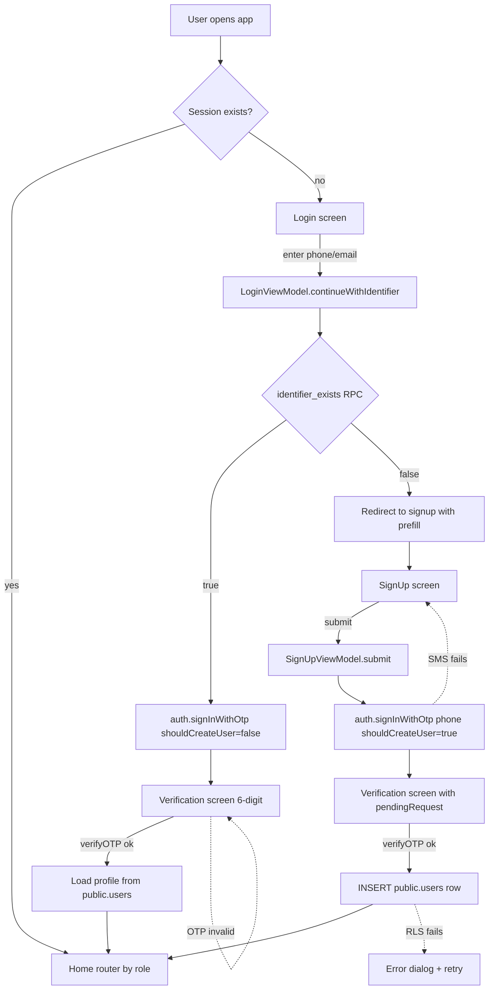

# Login + Sign-up Design Specification

**Status:** Draft · **Owner:** Dawer Team · **Last updated:** 2026-04-22
**Implementation tracker:** `plan/feature-supabase-auth-integration-1.md`
**Stack (fixed):** Flutter 3.x · Supabase (Postgres + GoTrue + RLS) · supabase_flutter 2.x

> This document is the blueprint the auth-integration plan executes against.
> When the spec and the plan disagree, update this file first and then adjust
> the plan's task list. No task in the plan should contradict section 4.

---

## 1. Goals & non-goals

### Goals
- **G1** — Login attempts are verified against `public.users` in the live Supabase project.
- **G2** — Any unregistered identifier (phone or email) produces a clear "no account yet" message and a one-tap path into sign-up with the identifier pre-filled.
- **G3** — Sign-up writes a row into `public.users` (not just `auth.users`) and the same identifier can log in immediately afterward with zero re-entry.
- **G4** — No passwords are stored in application tables. Credential material lives only inside `auth.users` (Supabase-managed) or is never persisted at all (OTP case).
- **G5** — Every branch has a typed Dart error with an Arabic user-facing message.

### Non-goals
- OAuth / social login (future phase).
- Multi-device session management UI (Supabase handles the session; we don't build a "devices" screen).
- Password reset UI (needed only if password auth is enabled; see §9).

---

## 2. Tech decision record

| Decision | Choice | Why |
|---|---|---|
| Primary credential | **Email OTP** for MVP · **Phone OTP** planned once Twilio is verified | UI already has 6-digit OTP screen; avoids password storage. Live project has `external.email=true` + `external.phone=false` (verified 2026-04-22 via `/auth/v1/settings`). Phone is still collected and stored in `public.users` so the channel flip is a config change, not a schema change. |
| Password support | **Documented as optional alternative** (§9) | Current UI collects no password; adding it is a UX change not required by the brief. |
| Identifier lookup before auth | **Supabase OTP `shouldCreateUser: false`** (primary) + **public RPC `identifier_exists()`** (fast hint) | OTP error gives authoritative "unregistered" signal; RPC avoids a wasted OTP send for obvious typos. |
| Profile table | **`public.users`** (FK `auth_id` → `auth.users.id`) | Already exists; RLS policies already in place (migrations 005 + 010 + 011). |
| SDK | `supabase_flutter` | Handles session persistence, token refresh, deep-link email callbacks. |
| SMS provider | **[FILL: Twilio vs. MessageBird vs. disabled-in-dev]** | Phase-1 task in the plan. |

---

## 3. High-level flow



**Contract:** every arrow labelled "ok" requires a valid Supabase session established by `verifyOTP`; every `INSERT public.users` runs under that session so RLS policy `users_insert_own` (requires `auth.uid() = auth_id`) passes.

---

## 4. Detailed flows

### 4.1 Login — identifier known

| Step | Actor | Action | Success criterion |
|---|---|---|---|
| L1 | User | Types identifier in login screen | Local validation per §5 passes |
| L2 | Client | Calls `identifier_exists(phone, email)` RPC | Returns `true` |
| L3 | Client | `auth.signInWithOtp(phone OR email, shouldCreateUser: false)` | Returns `void`, no error |
| L4 | User | Receives OTP via SMS/email, enters 6 digits | OTP entered |
| L5 | Client | `auth.verifyOTP(type: sms/email, token, phone/email)` | Returns `AuthResponse` with a non-null `session` |
| L6 | Client | `SELECT * FROM public.users WHERE auth_id = auth.uid()` | Returns exactly 1 row |
| L7 | Client | Navigate to `HomeRouter(role: profile.role)` | Route stack replaced |

### 4.2 Login — identifier unknown (redirect to sign-up)

| Step | Actor | Action | Success criterion |
|---|---|---|---|
| U1 | Client | RPC `identifier_exists` returns `false` **OR** `signInWithOtp` throws `AuthException(code: 'otp_disabled'/'user_not_found')` | Error surfaced |
| U2 | Client | Show banner: `لا يوجد حساب بهذا الرقم. أنشئ حساباً جديداً.` | Banner visible ≥ 2 s |
| U3 | Client | Navigate to sign-up screen with `prefillPhone` / `prefillEmail` set | Text inputs pre-populated, readonly until user explicitly edits |

### 4.3 Sign-up

| Step | Actor | Action | Success criterion |
|---|---|---|---|
| S1 | User | Fills form (name, phone/email, optional extras) | `SignUpRequest.validate()` returns empty map |
| S2 | Client | `UserSignUpService.requestOtp(request)` → `auth.signInWithOtp(phone, shouldCreateUser: true)` | No error |
| S3 | User | Receives OTP, enters 6 digits | OTP submitted |
| S4 | Client | `verifyOtpAndCreateProfile(request, otp)` — (a) `verifyOTP`, (b) INSERT into `public.users` with `auth_id = session.user.id` | 201 row returned |
| S5 | Client | Navigate to `HomeRouter(role: profile.role)` using **DB-returned** role (never the UI-selected one) | Correct home for role |

**Idempotency:** if step S4a succeeds but S4b fails (RLS 42501 race, network drop), a retry must not double-send OTP. Implementation keeps the verified session; on retry it runs an UPSERT keyed on `auth_id`.

### 4.4 Post-signup login

No separate flow needed. The `verifyOTP` in step S4a already creates a Supabase session. `supabase_flutter` persists it, so the next cold start goes through the `Session exists?` branch in §3 and lands on home.

---

## 5. Validation rules

Client-side = `SignUpRequest.validate()` in `lib/data/services/user_signup_service.dart`. Server-side = Postgres check constraints in migrations 003 + 004.

| Field | Client rule | Server rule | User message (ar) |
|---|---|---|---|
| `name` | 2 ≤ length ≤ 80, non-empty after trim | `chk_users_name_len` | `الرجاء إدخال الاسم (2 حرف على الأقل)` |
| `phone` | Matches `^\+?[0-9]{8,15}$` | `UNIQUE NOT NULL` + `chk_phone_format` | `رقم الهاتف غير صالح` / `هذا الرقم مسجّل مسبقاً` |
| `email` | Optional; if present matches RFC5322-lite regex | `UNIQUE` when not null | `البريد الإلكتروني غير صالح` |
| `role` | One of enum `{driver, supplier, recyclingCo, admin}` | `user_role` enum | (handled via UI role-picker) |
| `supplier_type` | Required when `role == supplier`, else null | `chk_supplier_fields` | `الرجاء اختيار نوع المورد` |
| `vehicle_plate` | Required when `role == driver` | `chk_driver_fields` | `الرجاء إدخال رقم اللوحة` |
| OTP | Exactly 6 digits | GoTrue verifies | `أكمل رمز التحقق من 6 أرقام` |

Duplicate-key (`23505`) and RLS-denied (`42501`) errors must be mapped to friendly messages per §7.

---

## 6. Data model & DB interactions

### 6.1 Tables used

Already exist. Source of truth: `supabase/migrations/20260422000003_tables.sql`.

```sql
-- Authoritative identity (Supabase-managed)
auth.users(id uuid PK, phone text, email text, encrypted_password text, ...)

-- App-layer profile (our domain)
public.users(
  id           uuid PK DEFAULT gen_random_uuid(),
  auth_id      uuid UNIQUE NOT NULL REFERENCES auth.users(id) ON DELETE CASCADE,
  name         text NOT NULL,
  phone        text UNIQUE NOT NULL,
  email        text UNIQUE,
  role         user_role NOT NULL,
  supplier_type supplier_type,
  vehicle_plate text,
  created_at   timestamptz DEFAULT now(),
  ...
)
```

### 6.2 New RPC needed

```sql
-- migrations/20260422000012_identifier_exists_rpc.sql
CREATE OR REPLACE FUNCTION public.identifier_exists(
  p_phone text DEFAULT NULL,
  p_email text DEFAULT NULL
)
RETURNS boolean
LANGUAGE sql
STABLE
SECURITY DEFINER
SET search_path = public
AS $$
  SELECT EXISTS (
    SELECT 1 FROM public.users
     WHERE (p_phone IS NOT NULL AND phone = p_phone)
        OR (p_email IS NOT NULL AND email = p_email)
  );
$$;

REVOKE ALL ON FUNCTION public.identifier_exists(text, text) FROM PUBLIC;
GRANT EXECUTE ON FUNCTION public.identifier_exists(text, text) TO anon, authenticated;
```

**Security note:** this is intentionally callable anonymously so the login screen can gate the OTP send. It leaks "is this phone registered" — a standard enumeration trade-off that SMS costs force. Rate-limited in §8.

### 6.3 RLS policies relied on

Fixed in migrations 010 + 011. Key invariants still in effect:

- `users_insert_own` — caller's `auth.uid()` must equal the new row's `auth_id`. Enforces that sign-up only creates a profile for the verifying user.
- `users_select_own` — caller sees their own row unconditionally.
- `users_select_participant` (now via `current_user_id()` helper) — caller sees rows of counterparties in their orders.

---

## 7. API surface (client ↔ Supabase)

All calls via `supabase_flutter`. No bespoke backend.

### 7.1 `identifier_exists`

```dart
final exists = await supabase.rpc<bool>('identifier_exists', params: {
  'p_phone': phone,        // nullable
  'p_email': email,        // nullable
});
```

### 7.2 Request OTP

```dart
// phone (preferred)
await supabase.auth.signInWithOtp(
  phone: '+962791234567',
  shouldCreateUser: isSignUp,   // true for signup flow, false for login
);
// email (fallback)
await supabase.auth.signInWithOtp(
  email: 'user@example.com',
  shouldCreateUser: isSignUp,
  emailRedirectTo: null,         // OTP only, no magic link
);
```

**Errors mapped:**

| GoTrue response | Our exception | User-facing (ar) |
|---|---|---|
| `AuthException('Signups not allowed for otp')` + `shouldCreateUser=false` | `OtpRequestException.unregistered` | Banner → "لا يوجد حساب، سجّل الآن" + route to sign-up |
| `AuthException(code: 'over_sms_send_rate_limit')` | `OtpRequestException.rateLimited` | "حاول بعد دقيقة" |
| `AuthException(code: 'invalid_phone')` | `OtpRequestException.badIdentifier` | "رقم الهاتف غير صالح" |
| Network / 5xx | `OtpRequestException.network` | "تعذّر الاتصال، حاول مجدداً" |

### 7.3 Verify OTP

```dart
final res = await supabase.auth.verifyOTP(
  type: OtpType.sms,            // or OtpType.email
  token: '123456',
  phone: '+962791234567',       // or email:
);
assert(res.session != null);
```

**Errors mapped:**

| Response | Exception | User-facing |
|---|---|---|
| `AuthException('Token has expired or is invalid')` | `OtpVerifyException.invalid` | "رمز غير صحيح أو منتهي" |
| `AuthException(code: 'over_email_send_rate_limit')` | `OtpVerifyException.rateLimited` | "حاول بعد دقيقة" |

### 7.4 Create profile (sign-up only)

```dart
final row = await supabase
    .from('users')
    .insert(request.toInsertPayload(authId: session.user.id))
    .select()
    .single();
```

**Errors mapped:**

| Response | Exception | User-facing |
|---|---|---|
| `PostgrestException(code: '23505', constraint: 'users_phone_key')` | `SignUpException.duplicatePhone` | "هذا الرقم مسجّل مسبقاً — سجّل الدخول بدلاً من الإنشاء" + route to login |
| `PostgrestException(code: '23505', constraint: 'users_email_key')` | `SignUpException.duplicateEmail` | "البريد الإلكتروني مستخدم" |
| `PostgrestException(code: '23514', ...)` (check constraint) | `SignUpException.invalidPayload` | field-specific message |
| `PostgrestException(code: '42501')` (RLS) | `SignUpException.unauthorized` | "انتهت الجلسة، أعد المحاولة" |

### 7.5 Load profile

```dart
final profile = await supabase
    .from('users')
    .select()
    .eq('auth_id', supabase.auth.currentUser!.id)
    .maybeSingle();
```

`null` profile after verified login means the user has an `auth.users` entry but not a `public.users` entry — treat as "unfinished sign-up", route to sign-up with `prefillFromAuth: true`.

---

## 8. Security & rate-limiting

| Concern | Mitigation |
|---|---|
| **Credential storage** | No passwords in `public.*`. `auth.users.encrypted_password` only populated if password auth enabled (§9). |
| **OTP brute force** | GoTrue enforces 6-digit retry limit + 60 s cooldown. Client adds UX timer. |
| **SMS pumping / cost abuse** | Configure per-IP and per-phone rate limits in Supabase dashboard → `Auth › Rate Limits`. **[FILL: final limits]** Recommended: 3 OTP sends per phone per hour; 10 per IP per hour. |
| **Enumeration via `identifier_exists`** | Accepted trade-off (see §6.2). Rate-limit the RPC at the edge: add `alter role anon set statement_timeout = '2s'` and an `auth.rate_limit()` wrapper if abuse appears. |
| **Session fixation** | `supabase_flutter` rotates JWT on `verifyOTP`; no custom cookies involved. |
| **JWT theft from device** | Device-encrypted secure storage (`flutter_secure_storage`) swapped in for the default `SharedPreferencesGotrueAsyncStorage`. **[FILL: track as plan TASK]** |
| **Deep-link hijacking (email magic links)** | Not used — we're OTP-only. `emailRedirectTo: null`. |
| **RLS bypass** | Only `current_user_id()` and `is_available_driver()` are `SECURITY DEFINER`; all other policies run as caller. Reviewed in migrations 010 + 011. |
| **PII exposure in logs** | Never log phone/email. Supabase debug mode off in release (`Supabase.initialize(debug: false)` in `lib/main.dart`). |

---

## 9. Optional: password auth path

Kept as an appendix because the UI has no password field today. Adding it is a 2-file change:

1. Add a `_passwordCtrl` to `signup_view.dart` + surface `errors['password']`.
2. In `UserSignUpService.signUp`, replace OTP with:
   ```dart
   final res = await supabase.auth.signUp(
     phone: request.phone,
     password: request.password!,
     data: {'role': request.role.dbValue},
   );
   if (res.session != null) {
     await _insertProfile(request, authId: res.user!.id);
   } else {
     // Email confirmation required — user sees "check your email".
   }
   ```
3. Login becomes:
   ```dart
   await supabase.auth.signInWithPassword(phone: phone, password: password);
   ```

Only pursue this after the Supabase project has:
- `[auth] enable_signup = true`
- `[auth.email] enable_confirmations = true` (if email auth)
- Reset-password flow wired (email template + `auth.resetPasswordForEmail`).

---

## 10. Client-side architecture

### 10.1 View models

```
lib/ui/features/auth/
  viewmodels/
    login_viewmodel.dart           # continueWithIdentifier() → OTP or redirect
    signup_viewmodel.dart          # submit() → OTP request
    verification_viewmodel.dart    # verify() → verifyOTP + profile insert OR load
  views/
    login_view.dart
    signup_view.dart
    verification_view.dart
    auth_gate.dart                 # NEW — routes based on session
```

### 10.2 Service layer

```
lib/data/services/
  user_signup_service.dart         # existing — extend with:
    requestOtp(SignUpRequest r)
    verifyOtpAndCreateProfile(SignUpRequest r, String otp)
    getOrCreateProfile(User authUser)
    identifierExists({String? phone, String? email})
  auth_service.dart                # NEW — login-only wrapper:
    requestLoginOtp(String identifier)
    verifyLoginOtp(String identifier, String otp)
    signOut()
    Stream<AuthState> authStream
```

### 10.3 State flow (Provider)

No global `AuthCubit`. Each VM is local; the **`AuthGate`** widget subscribes to `supabase.auth.onAuthStateChange` and switches between `LoginView` and `HomeRouter`. When `AuthGate` sees a session but `getOrCreateProfile` returns null, it routes to sign-up with `prefillFromAuth: true`.

---

## 11. Pseudocode: the critical paths

### 11.1 `LoginViewModel.continueWithIdentifier`

```dart
Future<void> continueWithIdentifier(String raw) async {
  _setLoading(true);
  try {
    final id = IdentifierParser.parse(raw); // → phone or email
    final exists = await _service.identifierExists(
      phone: id.phone, email: id.email,
    );
    if (!exists) {
      _pendingPrefill = id;
      _redirect = AuthRedirect.signupPrefill;
      return;
    }
    await _service.requestLoginOtp(id);
    _destination = id.display;
    _redirect = AuthRedirect.verification;
  } on OtpRequestException catch (e) {
    _error = e.userMessage;
  } catch (e) {
    _error = L10n.genericError;
  } finally {
    _setLoading(false);
  }
}
```

### 11.2 `SignUpViewModel.submit`

```dart
Future<void> submit() async {
  if (!_validate()) return;           // already wired
  _setLoading(true);
  try {
    final req = buildRequest();
    await _service.requestOtp(req);
    _pendingRequest = req;
    _redirect = AuthRedirect.verification;
  } on OtpRequestException catch (e) {
    _errors['submit'] = e.userMessage;
  } finally {
    _setLoading(false);
  }
}
```

### 11.3 `VerificationViewModel.verify`

```dart
Future<void> verify() async {
  if (!isComplete) { _error = L10n.otpIncomplete; return; }
  _setLoading(true);
  try {
    if (pendingRequest != null) {
      _profile = await _service.verifyOtpAndCreateProfile(
        pendingRequest!, _digits.join(),
      );
    } else {
      await _service.verifyLoginOtp(destination, _digits.join(), isEmail);
      _profile = await _service.getOrCreateProfile(
        Supabase.instance.client.auth.currentUser!,
      );
    }
    _verified = true;
  } on OtpVerifyException catch (e) {
    _error = e.userMessage;
  } on SignUpException catch (e) {
    _error = e.userMessage;
  } finally {
    _setLoading(false);
  }
}
```

---

## 12. Test matrix

| # | Scenario | Test type | File |
|---|---|---|---|
| T1 | Happy-path sign-up: phone + name → OTP → verify → row inserted | widget + live | `test/integration/signup_flow_test.dart` |
| T2 | Happy-path login: registered phone → OTP → home | widget + live | `test/integration/login_flow_test.dart` |
| T3 | Unregistered phone redirects to signup with prefill | unit (VM) | `test/ui/auth/login_viewmodel_test.dart` |
| T4 | Duplicate phone on signup → friendly error | unit (service) | `test/data/user_signup_service_otp_test.dart` |
| T5 | RLS 42501 on profile insert → retry path | unit | same |
| T6 | Wrong OTP → user sees retry UI | unit (VM) | `test/ui/auth/verification_viewmodel_test.dart` |
| T7 | Session persists across cold start | widget | `test/ui/auth/auth_gate_test.dart` |
| T8 | `identifier_exists` RPC security: anon can only read boolean, no data leaks | SQL | `test/sql/rpc_identifier_exists_test.sql` |
| T9 | Rate-limit: 4th OTP within 1 h returns `over_sms_send_rate_limit` | manual/QA | `docs/qa/auth-rate-limits.md` |

---

## 13. Rollout & flag strategy

1. **Dev** — migrations 010–012 already applied to live project; Phase-1 of the plan gates email OTP in dashboard.
2. **Staging behind a build flag** — `--dart-define=AUTH_MODE=live` vs. default mock. The `.env.local` check in `lib/main.dart:24` already serves as this flag.
3. **Prod cutover** — delete `MockAuthService` wiring (see plan TASK-019) in the same PR that switches `AUTH_MODE` default.

Rollback = revert that single PR; DB state is forward-compatible (no destructive migrations).

---

## 14. Open placeholders

| Placeholder | Owner | When needed |
|---|---|---|
| `[FILL: SMS provider]` | Product | Before Phase 1 TASK-002 |
| `[FILL: rate-limit values]` | Security | Before staging |
| `[FILL: email OTP template]` | Design | Phase 1 TASK-001 |
| `[FILL: `flutter_secure_storage` adoption]` | Eng lead | Before GA |
| `[FILL: terms & privacy URLs shown under signup button]` | Legal | Before GA |

---

## 15. Cross-references

- Implementation tasks → `plan/feature-supabase-auth-integration-1.md`
- RLS policies → `supabase/migrations/20260422000005_rls_and_views.sql` + `010` + `011`
- Sign-up service contract → `docs/supabase/user-signup.md`
- RLS reasoning → `docs/supabase/rls-matrix.md`
- Edge-function consumers that expect a `public.users` row → `docs/supabase/edge-functions.md`
